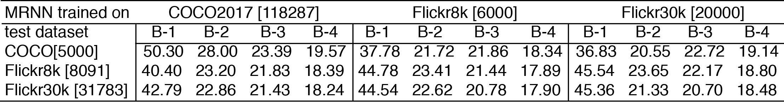
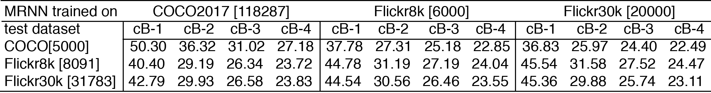
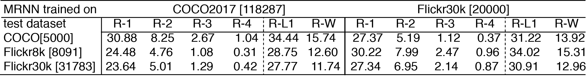

## Scores 

### Bleu scores

Table 1. Bleu Scores for 3 datasets

MRNN was trained on COCO2017 training dataset and tested on three datasets: COCO2017 validation (5000 images), Flickr8k (8091 images) and Flickr30k (31783 images). Intuitively, the model trained on COCO performs better on COCO validation dataset in terms of BLEU and ROUGE scores shown below. 

### Bleu scores (cumulative) 

Table 2. Cumulative Bleu scores

### Rouge scores 

Table 3. Rouge scores

